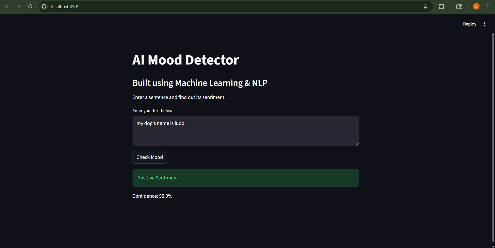

# AI Sentiment Analyzer

## Description
This is a machine learning-based web app that analyzes the sentiment of user input text and classifies it as Positive or Negative.

## Features
- Predicts sentiment of text
- Shows confidence score
- Interactive web interface
- Built using machine learning and NLP

## Tech Stack
- Python
- scikit-learn
- pandas
- Streamlit

## ▶How to Run

1. Install dependencies:
   pip install -r requirements.txt

2. Train the model:
   python train.py

3. Run the app:
   streamlit run app.py

## Example
Input: "I love this product"  
Output: Positive Sentiment 

## Output

## Author
Sethulekshmi S
Project maintained by sethu766.